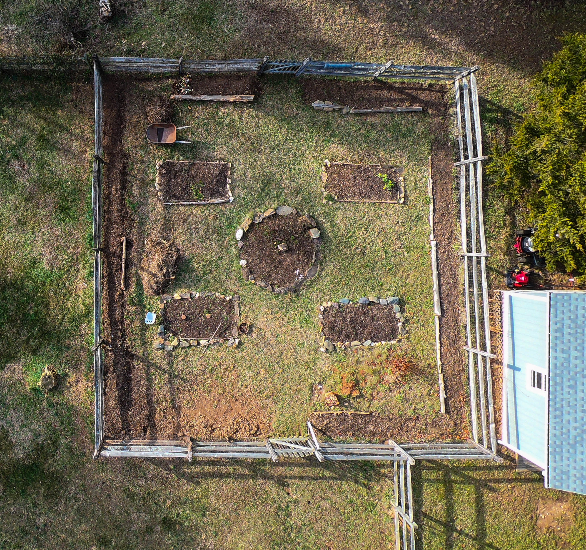

It's January and the onion grass is coming up. It appears earlier every year, which is not a good sign. Eight years ago, we wouldn't see it until March.
The warm weather has granted us (well, mostly Susie) a head start
preparing the potager for planting in the Spring. The worst part was removing 
large clumps of privet from the fence line. Privet, in my opinion, is an evil 
plant which shouldn't be allowed to establish anywhere.

Here's a birds-eye view.
 
