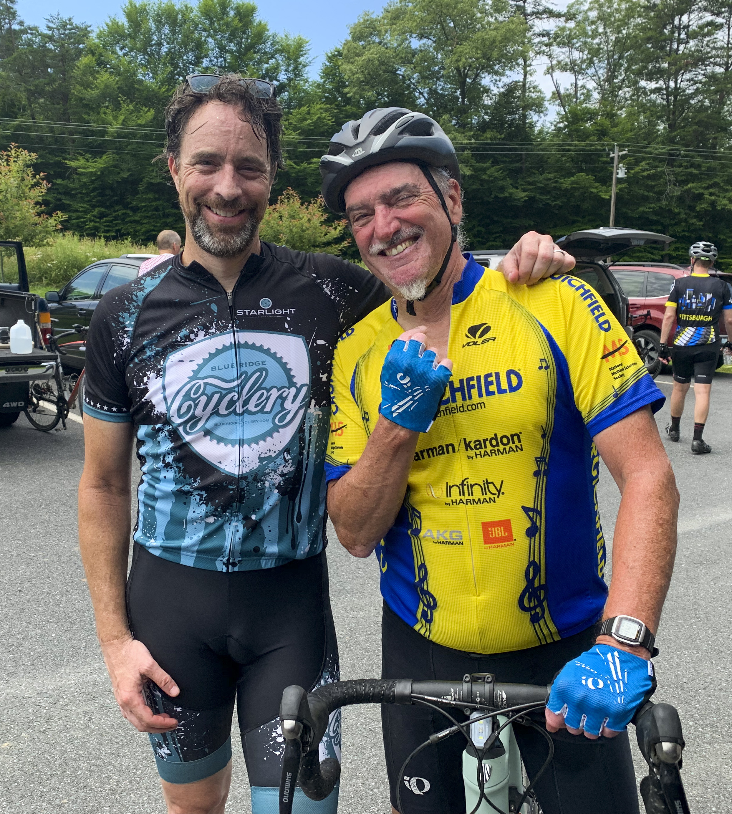

About eight years ago, I met Dennis Moler on my first group ride in Charlottesville. It
was a crisp autumn day, and I was in pretty good shape. About halfway through the ride
we stopped for a break and Dennis, with whom I had not yet spoken, walked up to me
with a serious look on his face.

"You're from California, right?"

I nodded.

Looking me directly in the eye, he continued...

"When it gets hot and humid in the summer, I am going to kick your ass."

He paused for a beat, his eyes lit up, and he laughed long and hard.

We've been good friends ever since. And yes, there were a couple of times the following summer when he kicked my ass.

A month and a half ago, Dennis was hit by a passing car's side view mirror. He suffered three broken ribs and a cracked femur.

Today, I rode with him for the first time since the accident.

Here's to good friends. Keep riding, buddy.

I'm ready for the next ass-kicking.

