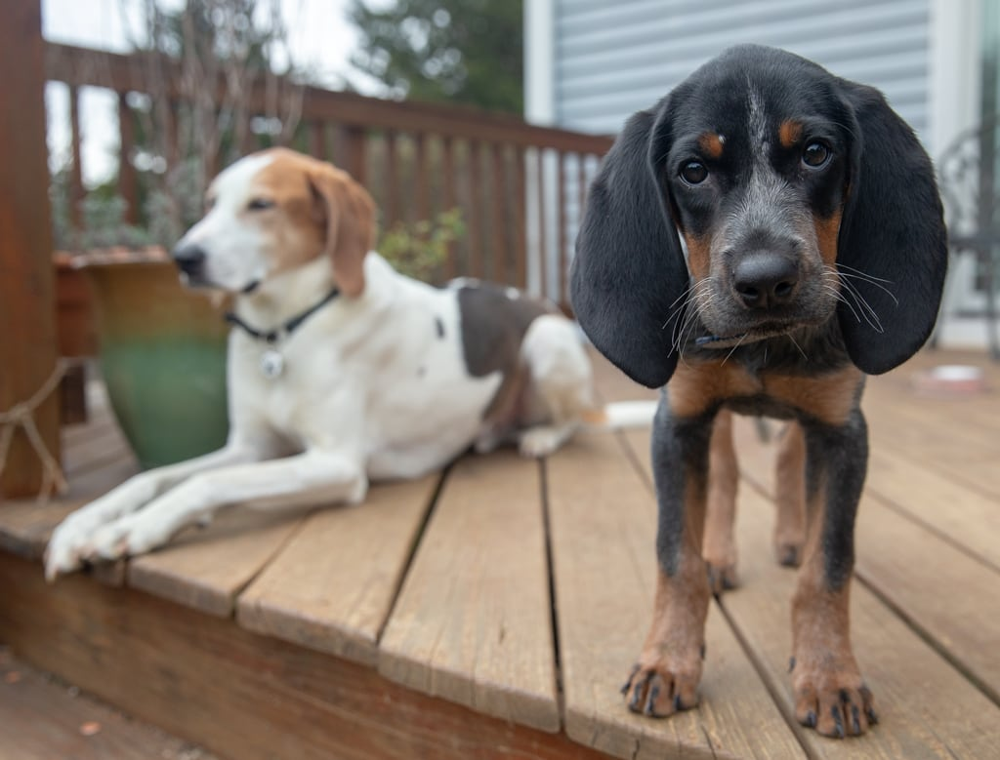
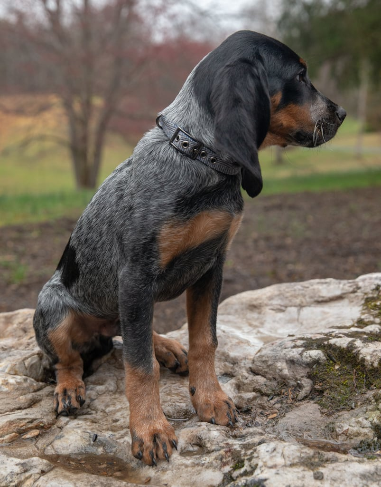
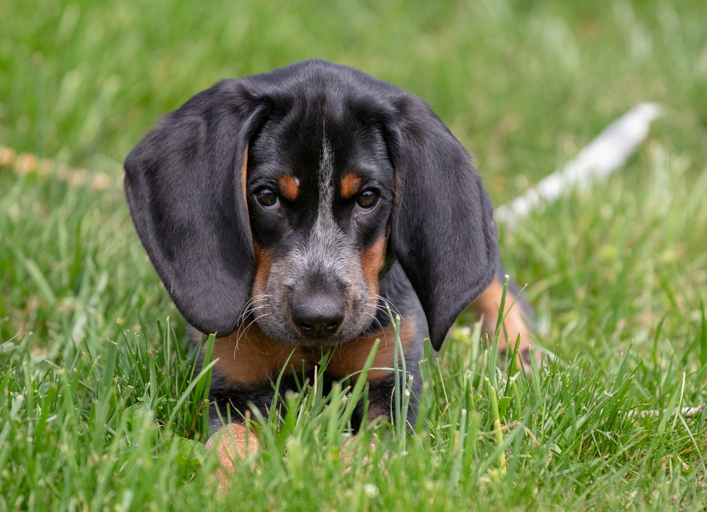

Never look at pictures of puppies while drinking margaritas. After an eighteen hour round-trip to just south of Buffalo to pick him up, we welcomed Walter, a bluetick coonhound, into our family. Henry and Bella aren't quite sure what to make of all this, but they are adjusting. They seem to enjoy stealing Walter's toys.

